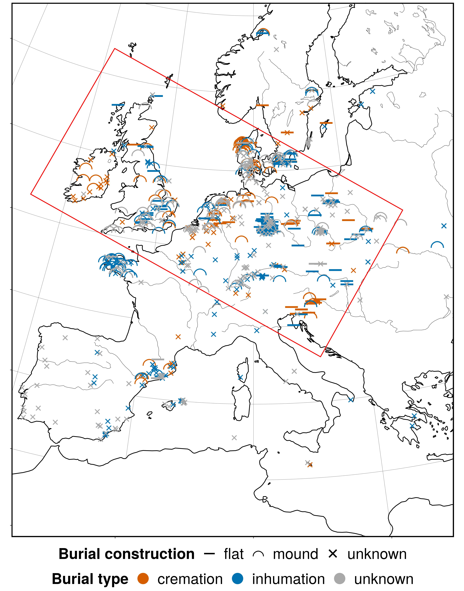

*Diese Präsentation habe ich für einen Vortrag am Institut für Prähistorische Archäologie der Freien Universität Berlin am 04.02.2020 vorbereitet. Es handelt sich um eine übersetzte, angepasste und weiter entwickelte Variante von Präsentationen, die ich auf der [CCS2018 Konferenz](https://github.com/nevrome/cultrans.bronzeageburials.ccs2018), auf einem [Workshop des MPI-SHH](https://github.com/nevrome/cultrans.bronzeageburials.NASHH2019) und schließlich an [Archäologischen Instituten in Seattle und Bern](https://github.com/nevrome/cultrans.bronzeageburials.article2019) gehalten habe.*

# Eine Rekonstruktion der Ausbreitung bronzezeitlicher Bestattungssitten im weiteren Mitteleuropa anhand von C14-Daten – Methodische Inspirationen zu Cultural Transmission

Die enorme Komplexität bronzezeitlicher Bestattungssitten lässt sich -- freilich unter Verlust der eigentlich immensen Variabilität von Ritualen und Traditionen -- auf zwei Hauptdimensionen reduzieren: Flachgräber gegenüber Hügelgräbern und Brandbestattungen im Gegensatz zu Körperbestattungen. Die europäische Bronzezeitforschung konzentriert sich oft auf diese Kategorien, wenn sie große Narrative zu sozialer Interaktion und kultureller Entwicklung spinnt. 

Diesem Vortrag liegt mit der Radon-B Datenbank (http://radon-b.ufg.uni-kiel.de) ein Datensatz zugrunde, der über kontextualisierte Radiokarbon-Datierungen Informationen zu Hügel-, Flach-, Brand- und Körpergräbern in Raum und Zeit bereitstellt. Punktinformationen dieser Art lassen sich nutzen, um die regionale Geschichte genannter Bestattungstraditionen quantitativ nachzuvollziehen und etabliertes, archäologisches Wissen zu prüfen. Außerdem kann die Entwicklung von Regionen verglichen werden, um die Natur von Ausbreitungsprozessen zu beschreiben und Kulturräume zu definieren.

Jenseits dieser induktiven Perspektive sind Bestattungsriten außergewöhnliches Kulturverhalten: Sie sind untrennbar mit persönlichem Verlust und tiefen, religiöse Überzeugungen verbunden -- keine kurzlebigen Moden und dennoch nicht unmittelbar überlebenswichtig. Cultural Evolution Theorie bietet einen möglichen Rahmen, ihre Ausbreitung formalisiert zu untersuchen und in Simulationen zu erforschen. 
