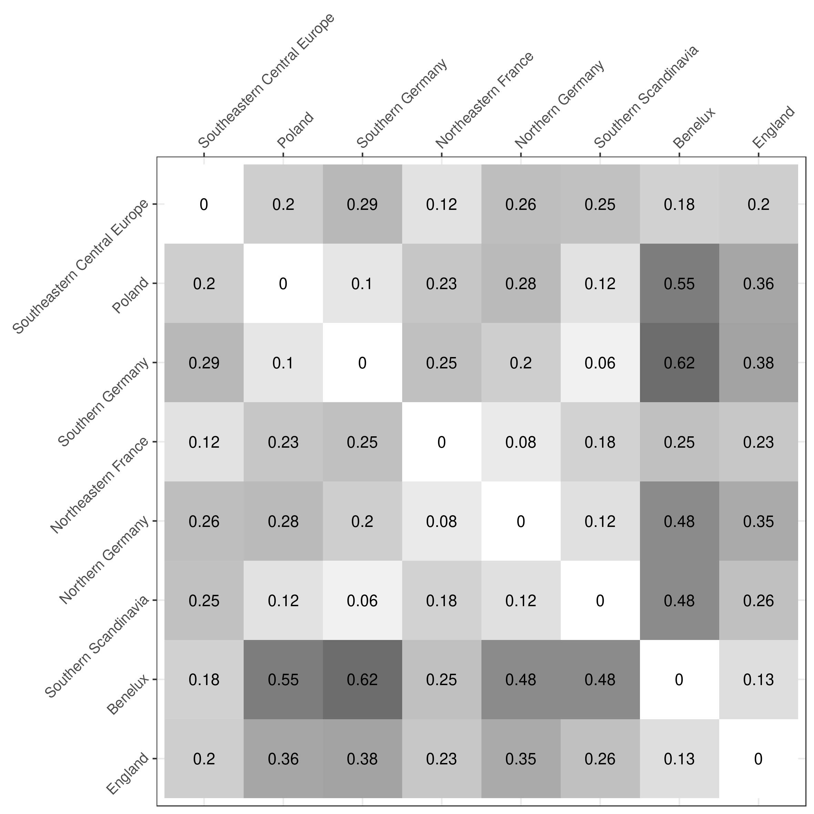
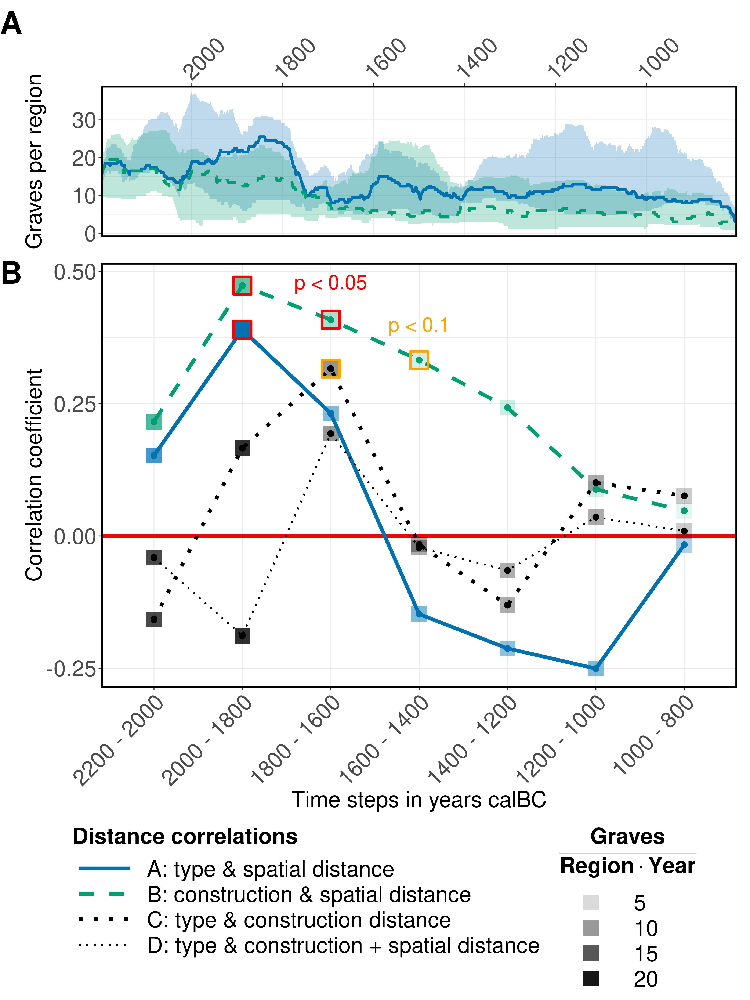
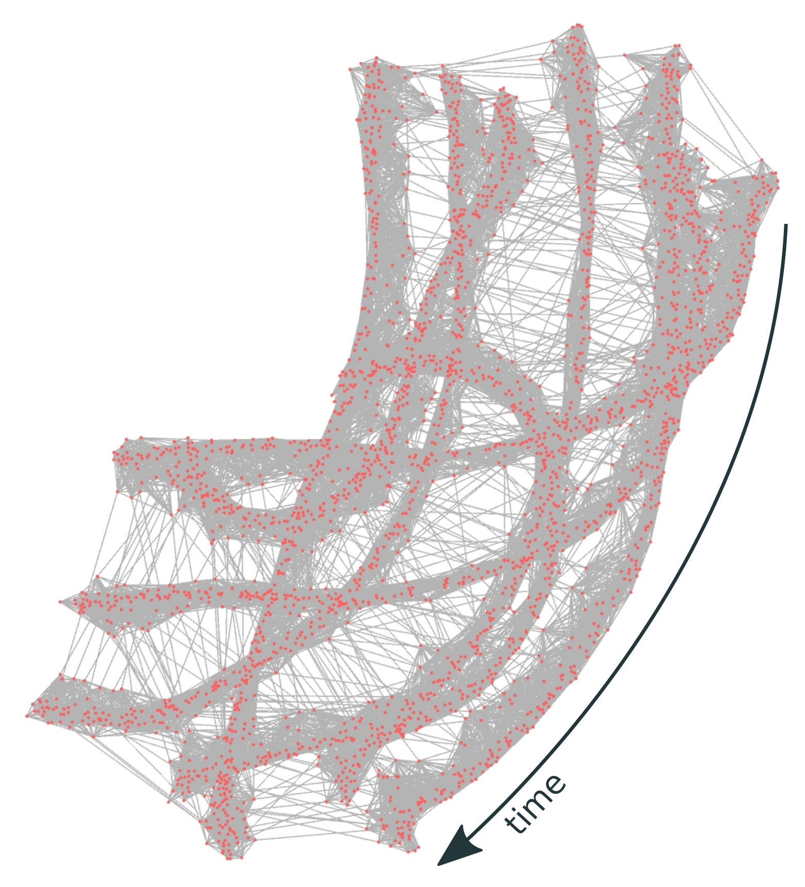
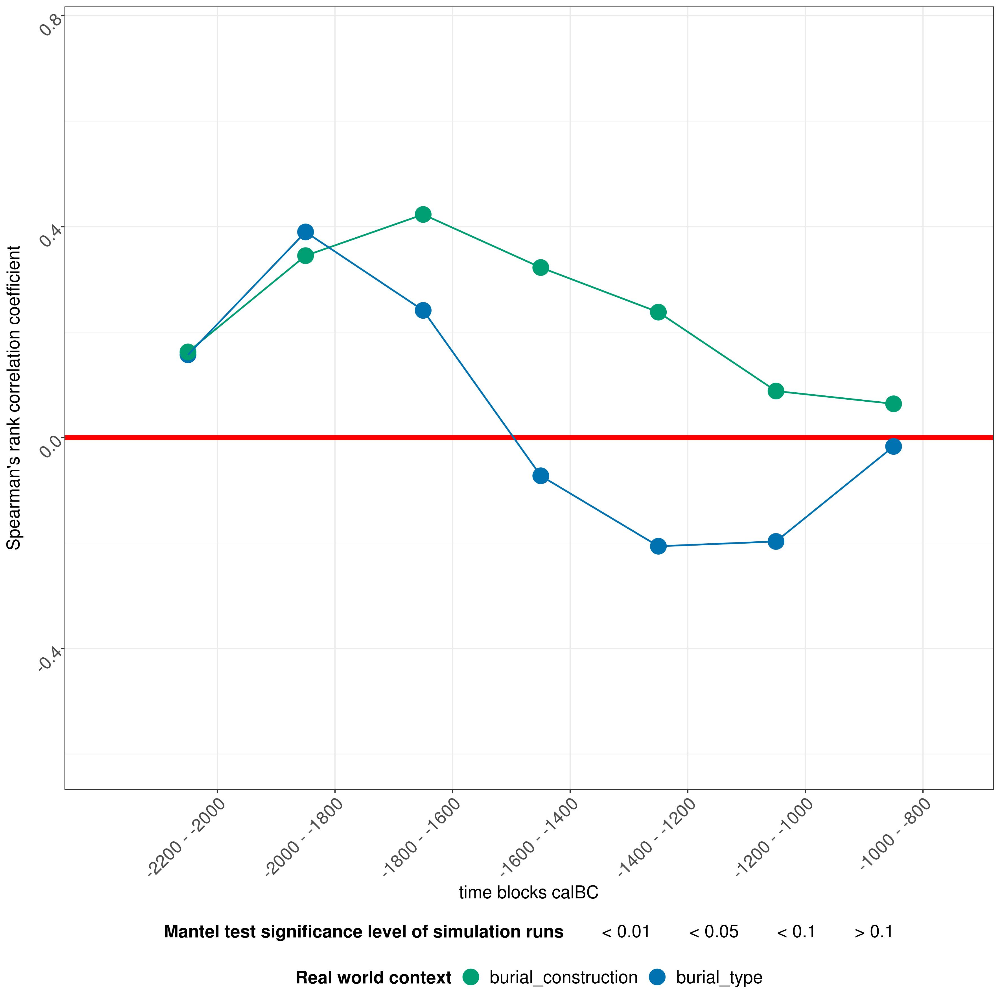
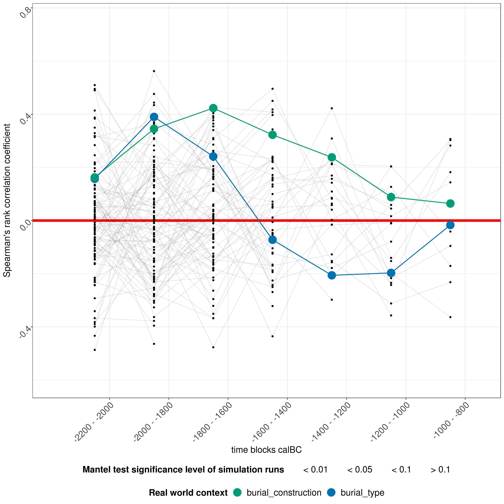
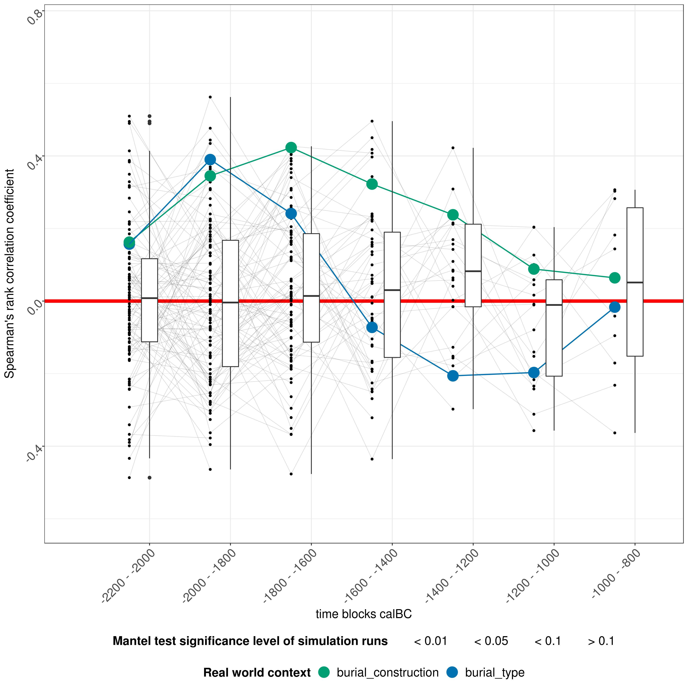
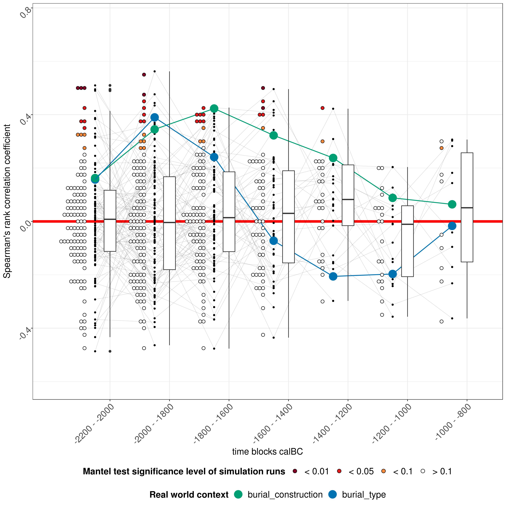
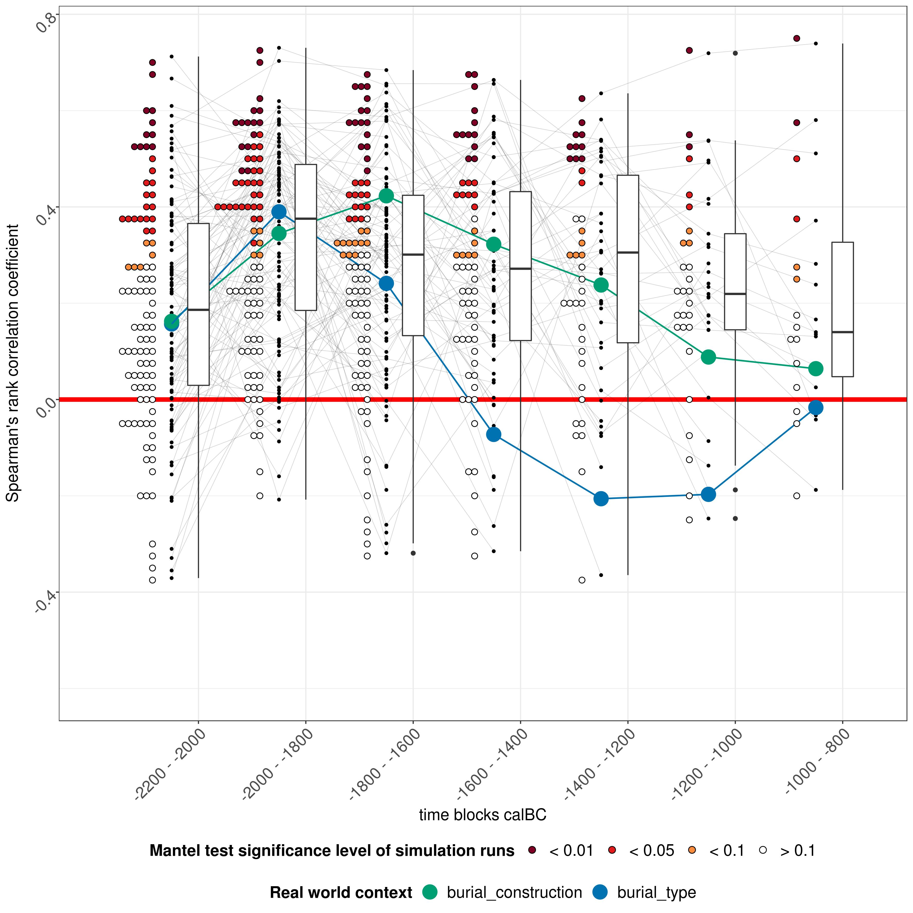

```{r, echo = FALSE}
# https://stackoverflow.com/questions/25646333/code-chunk-font-size-in-rmarkdown-with-knitr-and-latex
def.chunk.hook  <- knitr::knit_hooks$get("chunk")
knitr::knit_hooks$set(chunk = function(x, options) {
  x <- def.chunk.hook(x, options)
  ifelse(options$size != "normalsize", paste0("\\", options$size,"\n\n", x, "\n\n \\normalsize"), x)
})
knitr::opts_chunk$set(echo = TRUE, cache = TRUE)
```

##

\LARGE

\begin{figure}
  \centering
  \includegraphics[height=4cm]{figures/niels_bach_pyre}
  \caption*{\tiny \textcopyright \ Niels Bach - http://nielsbach.blogspot.com}
\end{figure}

- Einführung zum Datensatz
- Kulturelle Distanz, räumliche Distanz und Korrelation
- Interpolation und Gruppen (new!)
- Cultural Evolution
- Ideenausbreitung simulieren

# Einführung zum Datensatz

## Radiokarbondatierungen an Gräbern

\textblockcolour{nicegrey}

{height=80%}

\begin{textblock*}{65pt}(290pt,40pt)
  \textblockcolour{niceorange}
  \setlength\fboxrule{2pt}%
  \noindent\fbox{%
    \begin{minipage}{\linewidth - 2\fboxsep - 2\fboxrule}%
      \raggedright\footnotesize\color{white}
      \textbf{Radon-B:} Datenbank mit \textsuperscript{14}C-Daten aus der europäischen Bronzezeit
    \end{minipage}}%
\end{textblock*}

\begin{textblock*}{65pt}(290pt,100pt)
  \setlength\fboxrule{2pt}%
  \noindent\fbox{%
    \begin{minipage}{\linewidth - 2\fboxsep - 2\fboxrule}%
      \raggedright\footnotesize\color{white}
      \textsuperscript{14}C-Datierung ist eine wichtige absolute Datierungs\-methode:\\ Eine Datierung entspricht einem \textbf{unscharfen Punkt in Raum und Zeit mit Kontext\-informationen}
    \end{minipage}}%
\end{textblock*}

\textblockcolour{}

\begin{textblock*}{65pt}(5pt,40pt)
  \includegraphics{figures/burial_rites_clipart.jpg}
\end{textblock*}

\textblockcolour{nicegrey}

## Gräber durch die Zeit

\begin{adjustwidth}{-3em}{-3em}
  \begin{figure}
    \includegraphics{figures/general_map_research_area_timeslices.jpeg}
    \caption{Plotmatrix: \textsuperscript{14}C-Daten an Gräbern durch die Zeit.
    }
  \end{figure}
\end{adjustwidth}

\begin{textblock*}{65pt}(290pt,210pt)
  \setlength\fboxrule{2pt}%
  \noindent\fbox{%
    \begin{minipage}{\linewidth - 2\fboxsep - 2\fboxrule}%
      \raggedright\footnotesize\color{white}
      Heterogene \textbf{Informationsdichte} in Raum und Zeit
    \end{minipage}}%
\end{textblock*}

## Künstliche Macro-Regionen

{ height=85% }

\begin{textblock*}{75pt}(30pt,140pt)
  \setlength\fboxrule{2pt}%
  \noindent\fbox{%
    \begin{minipage}{\linewidth - 2\fboxsep - 2\fboxrule}%
      \raggedright\footnotesize\color{white}
      Teile und Herrsche: Acht \textbf{künstliche Regionen} im Forschungsareal
    \end{minipage}}%
\end{textblock*}

## Regionale Zeitreihen -- Absolute Anzahl

\begin{columns}
  \begin{column}{0.48\textwidth}  
    \begin{figure}
      \includegraphics{figures/development_amount_regions_burial_type.jpeg}
      \caption{\textbf{burial type} development: Summe der \textsuperscript{14}C-Datierungen deren $2\sigma$ Bereich das jeweilige Jahr enthält.}
    \end{figure}
  \end{column}
  \begin{column}{0.35\textwidth}
    \begin{figure}
      \includegraphics{figures/development_amount_regions_burial_construction.jpeg}
      \caption{\textbf{burial construction}}
      \vspace{1.8cm}
    \end{figure}
  \end{column}
\end{columns}

\begin{textblock*}{120pt}(215pt,220pt)
  \setlength\fboxrule{2pt}%
  \noindent\fbox{%
    \begin{minipage}{\linewidth - 2\fboxsep - 2\fboxrule}%
      \raggedright\footnotesize\color{white}
      Anpassung der Datenstruktur: Von einzelnen \textsuperscript{14}C-Datierungen zu regionalen \textbf{Zeitreihen} der \textbf{Anwesenheit} bestimmter Bestattungssitten.
    \end{minipage}}%
\end{textblock*}

## Regionale Zeitreihen -- Relative Anteile

\begin{columns}
  \begin{column}{0.48\textwidth}
    \begin{figure}
      \includegraphics{figures/development_proportions_regions_burial_type.jpeg}
      \caption{\textbf{burial type} Entwicklung: Jahrweise Anteile der Bestattungssitten. \textit{unknown} wurde entfernt.}
    \end{figure}
  \end{column}
  \begin{column}{0.35\textwidth}
    \begin{figure}
      \includegraphics{figures/development_proportions_regions_burial_construction.jpeg}
      \caption{\textbf{burial construction}}
      \vspace{1.8cm}
    \end{figure}
  \end{column}
\end{columns}

\begin{textblock*}{120pt}(215pt,220pt)
  \setlength\fboxrule{2pt}%
  \noindent\fbox{%
    \begin{minipage}{\linewidth - 2\fboxsep - 2\fboxrule}%
      \raggedright\footnotesize\color{white}
      Anpassung der Datenstruktur: Von Zeitreihen der absoluten Anzahl zu  \textbf{Zeitreihen} der \textbf{Anteile} -- \textbf{ein Proxy}
    \end{minipage}}%
\end{textblock*}

## Beobachtungen und Hypothesen

- **Punktdaten in Raum und Zeit** lassen sich zu **Proxies** umwandeln.

- Die **wichtigsten Entwicklungen** in der Verteilung europäisch-bronzezeitlicher Bestattungssitten lassen sich mit dieser **Radiokarbondatensammlung nachvollziehen**. 

# Kulturelle Distanz, räumliche Distanz und Korrelation

## Kulturelle Distanz messen

Wie verhalten sich die regionalen Entwicklungen hinsichtlich **burial type** und **burial construction** zueinander? Welche Regionen verhalten sich ähnlich? Können wir die **Intensität räumlicher Interaktion** messen?

\usebeamertemplate*{title separator}

Die **Quadrierte Euklidische Distanz** (QED) ist ein einfaches Maß der **Ähnlichkeit zwischen Gruppen**, das sich auf den Proxy-Datensatz anwenden lässt.

\huge $$d_{ij}^2 = \sum_{k = 1}^{n} (p_{ik} - p_{jk})^2$$ \normalsize

- $d_{ij}^2$: Quadrierte Euklidische Distanz zwischen zwei Gruppen $i$ und $j$
- $k$: Variantenzähler
- $n$: Summe der Varianten
- $p_{ik}$: Relative Häufigkeit der $k$'ten Variante in einer Population$i$
- $p_{jk}$: Relative Häufigkeit der $k$'ten Variante in einer Population$j$

## Distanzentwicklungsmatrix

{ height=75% }

\begin{textblock*}{65pt}(5pt,40pt)
  \textblockcolour{niceorange}
  \setlength\fboxrule{2pt}%
  \noindent\fbox{%
    \begin{minipage}{\linewidth - 2\fboxsep - 2\fboxrule}%
      \raggedright\footnotesize\color{white}
      The \textbf{QED} kann für jedes Jahr und jede der $8*8=64$ Regionen-Paare berechnet werden
    \end{minipage}}%
\end{textblock*}

\begin{textblock*}{65pt}(5pt,170pt)
  \textblockcolour{burialconstruction}
  \setlength\fboxrule{2pt}%
  \noindent\fbox{%
    \begin{minipage}{\linewidth - 2\fboxsep - 2\fboxrule}%
      \raggedright\footnotesize\color{white}
      \textbf{burial construction}:
      Heterogene Distanzentwicklung
    \end{minipage}}%
\end{textblock*}

\begin{textblock*}{65pt}(295pt,40pt)
  \textblockcolour{burialtype}
  \setlength\fboxrule{2pt}%
  \noindent\fbox{%
    \begin{minipage}{\linewidth - 2\fboxsep - 2\fboxrule}%
      \raggedright\footnotesize\color{white}
      \textbf{burial type}: \newline
      Hohe Ähnlichkeit zu Anfang und am Ende aufgrund des \textbf{allgemeinen Übergangs von Körper- zu Brandbestattung} (Urnenfelder Kultur)
    \end{minipage}}%
\end{textblock*}

\begin{textblock*}{65pt}(295pt,150pt)
  \textblockcolour{burialtype}
  \setlength\fboxrule{2pt}%
  \noindent\fbox{%
    \begin{minipage}{\linewidth - 2\fboxsep - 2\fboxrule}%
      \raggedright\footnotesize\color{white}
      Unterschiedliche \textbf{Übernahmegeschwindigkeiten} bilden sich als \textbf{Distanzspitzen} ab
    \end{minipage}}%
\end{textblock*}

## Mittlere Distanzmatrix: Burial Type

{ height=80% }

\begin{textblock*}{55pt}(10pt,130pt)
  \setlength\fboxrule{2pt}%
  \noindent\fbox{%
    \begin{minipage}{\linewidth - 2\fboxsep - 2\fboxrule}%
      \raggedright\footnotesize\color{white}
      Zentral\-europäisches Cluster?
    \end{minipage}}%
\end{textblock*}

## Mittlere Distanzmatrix: Burial Construction

{ height=80% }

\begin{textblock*}{55pt}(300pt,200pt)
  \setlength\fboxrule{2pt}%
  \noindent\fbox{%
    \begin{minipage}{\linewidth - 2\fboxsep - 2\fboxrule}%
      \raggedright\footnotesize\color{white}
      Nordwest\-europäisches Cluster?
    \end{minipage}}%
\end{textblock*}

## Korrelation kultureller Distanzen

\begin{adjustwidth}{-3em}{-3em}
  \begin{figure}
    \includegraphics{figures/squared_euclidian_distance_burial_type_vs_burial_construction.jpeg}
    \caption{Korrelation der mittleren \textbf{burial type} und \textbf{burial construction} QED in Zeitscheiben von 200 Jahren. Jeder Doppelpunkt repräsentiert ein Regionenpaar.}
  \end{figure}
\end{adjustwidth}

\begin{textblock*}{60pt}(295pt,130pt)
  \setlength\fboxrule{2pt}%
  \noindent\fbox{%
    \begin{minipage}{\linewidth - 2\fboxsep - 2\fboxrule}%
      \raggedright\footnotesize\color{white}
      Die \textbf{burial type} und \textbf{construction} Distanzen \textbf{korrelieren nicht} -- außer vielleicht in der späten Frühbronzezeit
    \end{minipage}}%
\end{textblock*}

## Definition räumlicher Distanzklassen

{ height=85% }

\begin{textblock*}{100pt}(15pt,50pt)
  \setlength\fboxrule{2pt}%
  \noindent\fbox{%
    \begin{minipage}{\linewidth - 2\fboxsep - 2\fboxrule}%
      \raggedright\footnotesize\color{white}
      Die künstlichen Analyseregionen erschweren die Messung räumlicher Distanzen. \textbf{Ordinalskalierte Distanzklassen} verbleiben als einzige Option.
    \end{minipage}}%
\end{textblock*}

## Correlation of **Burial Type** and **Spatial** Distance

\begin{adjustwidth}{-3em}{-3em}
  \begin{figure}
    \includegraphics{figures/squared_euclidian_distance_vs_spatial_distance_burial_type.jpeg}
    \caption{\textbf{burial type}: Correlation of mean SED and spatial distance in timeslices of 200 years.}
  \end{figure}
\end{adjustwidth}

\begin{textblock*}{60pt}(290pt,130pt)
  \setlength\fboxrule{2pt}%
  \noindent\fbox{%
    \begin{minipage}{\linewidth - 2\fboxsep - 2\fboxrule}%
      \raggedright\footnotesize\color{white}
      Spatial distance is only relevant \textbf{before} the widespread transformation in the Middle Bronze Age starts
    \end{minipage}}%
\end{textblock*}

## Correlation of **Burial Construction** and **Spatial** Distance

\begin{adjustwidth}{-3em}{-3em}
  \begin{figure}
    \includegraphics{figures/squared_euclidian_distance_vs_spatial_distance_burial_construction.jpeg}
    \caption{\textbf{burial construction}: Correlation of mean SED and spatial distance in timeslices of 200 years.}
  \end{figure}
\end{adjustwidth}

\begin{textblock*}{60pt}(290pt,130pt)
  \setlength\fboxrule{2pt}%
  \noindent\fbox{%
    \begin{minipage}{\linewidth - 2\fboxsep - 2\fboxrule}%
      \raggedright\footnotesize\color{white}
      Spatial distance is overall \textbf{more relevant} and again in the late Early Bronze Age significant
    \end{minipage}}%
\end{textblock*}

## Ergebnis: Korrelation kultureller und räumlicher Distanz

{ height=80% }

\textblockcolour{burialtype}

\begin{textblock*}{70pt}(285pt,130pt)
  \setlength\fboxrule{2pt}%
  \noindent\fbox{%
    \begin{minipage}{\linewidth - 2\fboxsep - 2\fboxrule}%
      \raggedright\footnotesize\color{white}
      \textbf{A:} burial type \& spatial distance \newline \newline
      Schwache Korrelation in der Frühbronzezeit,
      \textbf{negative} in der Spätbronzezeit
    \end{minipage}}%
\end{textblock*}

\textblockcolour{burialconstruction}

\begin{textblock*}{70pt}(10pt,130pt)
  \setlength\fboxrule{2pt}%
  \noindent\fbox{%
    \begin{minipage}{\linewidth - 2\fboxsep - 2\fboxrule}%
      \raggedright\footnotesize\color{white}
      \textbf{B:} burial construction \& spatial distance \newline \newline
      Schwache Korrelation in der Frühbronzezeit,
      keine in der Spätbronzezeit
    \end{minipage}}%
\end{textblock*}

\textblockcolour{nicegrey}

\begin{textblock*}{70pt}(10pt,40pt)
  \setlength\fboxrule{2pt}%
  \noindent\fbox{%
    \begin{minipage}{\linewidth - 2\fboxsep - 2\fboxrule}%
      \raggedright\footnotesize\color{white}
      \textbf{C\&D:} burial type \& burial construction distance \newline \newline
      Keine signifikante Korrelation
    \end{minipage}}%
\end{textblock*}

## Beobachtungen und Hypothesen

- Die Ausbreitung der Brandbestattungssitte und Flach- und Hügelgrabtraditionen scheinen **weitestgehend unabhängig** voneinander abzulaufen

- Beide Prozesse scheinen **weitestgehend unabhängig von räumlicher Distanz** abzulaufen, abgesehen von der Frühbronzezeit

- Große Phänomene wie **Tumulus Kultur** und **Urnenfelder Kultur** scheinen sich auf diesem Maßstab **nicht in einfachen Diffusionsprozessen** auszubreiten

- Andere, nicht unmittelbar räumlich definierte **Interaktionsnetzwerke** könnten die Entwicklung besser erklären: z.B. Elitennetzwerke

# Interpolation und Gruppen

## Punkte in Raum und Zeit: 2D

\begin{adjustwidth}{-3em}{-3em}
  \begin{figure}
    \includegraphics{../cultrans.bronzeageburials.article2020/analysis/figures/map_timeslices.jpeg}
    \caption{Plotmatrix: \textsuperscript{14}C-Daten an Gräbern durch die Zeit.}
  \end{figure}
\end{adjustwidth}

## Punkte in Raum und Zeit: 3D

{ height=83% }

## 3D Tesselation

{ height=83% }

\begin{textblock*}{70pt}(10pt,40pt)
  \setlength\fboxrule{2pt}%
  \noindent\fbox{%
    \begin{minipage}{\linewidth - 2\fboxsep - 2\fboxrule}%
      \raggedright\footnotesize\color{white}
      Tessellation (Parkettierung) bezeichnet die \textbf{überlappunsfreie} Auffüllung von Flächen und Räumen mit \textbf{Polygonen} 
    \end{minipage}}%
\end{textblock*}

\begin{textblock*}{70pt}(285pt,200pt)
  \setlength\fboxrule{2pt}%
  \noindent\fbox{%
    \begin{minipage}{\linewidth - 2\fboxsep - 2\fboxrule}%
      \raggedright\footnotesize\color{white}
      Die Software \textbf{voro++} erlaubt die einfache Anwendung dieser Technik
    \end{minipage}}%
\end{textblock*}

## 3D Tesselation: Burial Type

\begin{adjustwidth}{-3em}{-3em}
  \begin{figure}
    \includegraphics{../cultrans.bronzeageburials.article2020/analysis/figures/bleiglas_matrix_burial_type.png}
    \caption{Zeitscheibenschnitte durch den tesselierten Raum für die Variable \textbf{burial type}.}
  \end{figure}
\end{adjustwidth}

\begin{textblock*}{160pt}(180pt,245pt)
  \setlength\fboxrule{2pt}%
  \noindent\fbox{%
    \begin{minipage}{\linewidth - 2\fboxsep - 2\fboxrule}%
      \raggedright\footnotesize\color{white}
      Das R Paket \textbf{bleiglas} führt die erforderlichen Berechnungen automatisch aus.
    \end{minipage}}%
\end{textblock*}

## Gaussprozessregression

{ height=83% }

\begin{textblock*}{70pt}(10pt,30pt)
  \setlength\fboxrule{2pt}%
  \noindent\fbox{%
    \begin{minipage}{\linewidth - 2\fboxsep - 2\fboxrule}%
      \raggedright\footnotesize\color{white}
      Gaussprozess\-regression (Kriging) ist eine \textbf{Interpolationsmethode} für \textbf{n Dimensionen}. Sie liefert für jede Vorhersage ein \textbf{Unsicherheitsmaß}
    \end{minipage}}%
\end{textblock*}

\begin{textblock*}{70pt}(285pt,20pt)
  \setlength\fboxrule{2pt}%
  \noindent\fbox{%
    \begin{minipage}{\linewidth - 2\fboxsep - 2\fboxrule}%
      \raggedright\footnotesize\color{white}
      Quadrierter, exponentieller Kernel
      $$K_{ij} = e^{\frac{-\|x_i - x_j\|^2}{\theta}}$$ 
      mit $\theta = 50km$ und $\theta = 200 \text{ Jahre}$
      sowie ein angenommener Eingabefehler von $0.2$
    \end{minipage}}%
\end{textblock*}

\begin{textblock*}{70pt}(285pt,200pt)
  \setlength\fboxrule{2pt}%
  \noindent\fbox{%
    \begin{minipage}{\linewidth - 2\fboxsep - 2\fboxrule}%
      \raggedright\footnotesize\color{white}
      Das R Paket \textbf{laGP} ist eine besonders schnelle Implementierung von GPR
    \end{minipage}}%
\end{textblock*}

## Gaussprozessregression: Burial Type

\begin{adjustwidth}{-3em}{-3em}
  \begin{figure}
    \includegraphics{../cultrans.bronzeageburials.article2020/analysis/figures/gpr_model_mean_map_burial_type.png}
    \caption{Zeitscheibenschnitte durch den interpolierten Raum für die Variable \textbf{burial type}. Unsicherheit wird mit Transparenz visualisiert.}
  \end{figure}
\end{adjustwidth}

## Gaussprozessregression: Burial Construction

\begin{adjustwidth}{-3em}{-3em}
  \begin{figure}
    \includegraphics{../cultrans.bronzeageburials.article2020/analysis/figures/gpr_model_mean_map_burial_construction.png}
    \caption{Zeitscheibenschnitte durch den interpolierten Raum für die Variable \textbf{burial construction}. Unsicherheit wird mit Transparenz visualisiert.}
  \end{figure}
\end{adjustwidth}

## Diachronen Verhaltens an jedem Punkt im Raum

\begin{adjustwidth}{-3em}{-3em}
  \begin{figure}
    \includegraphics{../cultrans.bronzeageburials.article2020/analysis/figures/gpr_kmeans_mean_bc+bt_3_clusterdef_raw.png}
    \caption{Vorhersageergebnisse für \textbf{burial type} und \textbf{burial construction} durch die Zeit \newline für jeden Punkt im geographischen Raum mit durchgehend hinreichender Informationsdichte.}
  \end{figure}
\end{adjustwidth}

## Gruppen mit ähnlichem diachronen Verhalten

\begin{adjustwidth}{-3em}{-3em}
  \begin{figure}
    \includegraphics{../cultrans.bronzeageburials.article2020/analysis/figures/gpr_kmeans_mean_bc+bt_3_clusterdef.png}
    \caption{Klassifizierung der Vorhersageergebnisse. Mittelwert und Standardabweichung für jedes Cluster in jedem Zeitschritt.}
  \end{figure}
\end{adjustwidth}

\begin{textblock*}{100pt}(240pt,235pt)
  \setlength\fboxrule{2pt}%
  \noindent\fbox{%
    \begin{minipage}{\linewidth - 2\fboxsep - 2\fboxrule}%
      \raggedright\footnotesize\color{white}
      Die diachronen \textbf{Zeitsäulen} lassen sich mit Clusteranalyse (\textbf{kmeans}) klassifizieren
    \end{minipage}}%
\end{textblock*}

## Gruppen im diachronen Verhalten: Mittelwert

\begin{adjustwidth}{-3em}{-3em}
  \begin{figure}
    \includegraphics{../cultrans.bronzeageburials.article2020/analysis/figures/gpr_kmeans_mean_bc+bt_3_map.png}
    \caption{Kartierung der Cluster.}
  \end{figure}
\end{adjustwidth}

## Gruppen im diachronen Verhalten: Iteration und Sampling

\begin{adjustwidth}{-3em}{-3em}
  \begin{figure}
    \includegraphics{../cultrans.bronzeageburials.article2020/analysis/figures/gpr_kmeans_iterative_bc+bt_3_map.png}
    \caption{Kartierung der Cluster nach 100 Wiederholungen.}
  \end{figure}
\end{adjustwidth}

\begin{textblock*}{160pt}(180pt,215pt)
  \setlength\fboxrule{2pt}%
  \noindent\fbox{%
    \begin{minipage}{\linewidth - 2\fboxsep - 2\fboxrule}%
      \raggedright\footnotesize\color{white}
      Aufgrund der Ungenauigkeit von Eingabedaten (\textsuperscript{14}C) und Interpolationsergebnissen (GPR) genügt es nicht, jeweils mit Mittelwerten zu arbeiten. \newline \textbf{Das Ergebnis bleibt jedoch stabil}
    \end{minipage}}%
\end{textblock*}

## Beobachtungen und Hypothesen

- **Punktdaten in Raum und Zeit** lassen sich vielfältig visualisieren und die **3D Perspektive** kann zu nützlichen 2D Visualisierungen führen.

- Gut durchdachte **Interpolation** erlaubt es, **Hypothesen** zu Zeiten und Räumen ohne Messungen zu formulieren.

- **Gaussprozessregression** erlaubt Interpolation mit einer **Unsicherheitsabschätzung**.

- Interpolierte **Zeitreihen** lassen sich zur **Gruppendefinition** heranziehen.

# Cultural Evolution

## Cultural Evolution Theorie: Definition

- Die Prozesse der **natürlichen Entwicklung** von Spezies durch Evolution wirken auch bei der **menschlichen Kulturentwicklung**

- **Mechanismen der Evolution** wie Drift, Flow, Selektion und Mutation sind entscheidend dafür, welche **Verhaltensweisen, Ideen und Innovationen** sich langfristig **durchsetzen** können

- **Biologische Terminologie und Methodik** kann auch in **anthropologischen Kontexten** sinnvoll eingesetzt werden

## Cultural Evolution Theorie: Anfang des 19. Jhds. bis 1970. 

- **Evolutionismus**
  - schrittweiser, kulturellen **Aufstieg**, Zunahme organisatorischer **Komplexität**, **Teleologie** der Kulturgeschichte, Marktwirtschaftlicher **Wettbewerb**
  - **Vergleichende Methode**
  - Inspiration für rassistische und **sozialdarwinistische** Theorien: *Nie und nirgends sind Staaten anders entstanden als durch Unterwerfung fremder Stämme seitens eines oder mehrerer verbündeter oder geeinigter Stämme.* - Gumplowicz (1885), 99.
\newline
- **Kulturrelativismus** und **Historischer Partikularismus**
  - Kulturanthropologie und Boasianer
  - Fokus auf den jeweiligen **naturräumlichen, historischen und soziopolitischen Kontext** einzelner kultureller Ausprägung **ohne Hierarchisierung**
  - Induktive, empirische Detailanalyse, Interdisziplinarität, Datensammlung
\newline
- **Neoevolutionismus**
  - Ablehnung sozialdarwinistischen Biodeterminismus, aber dennoch bewusste **Suche nach Gesetzmäßigkeiten soziokultureller Prozesse**
  - Vere Gordon Childe, Karl Wittfogel, Leslie White, George Murdock, später Elman Service, Morton Fried, Roy Rappaport, Lewis Binford

## Cultural Evolution Theorie: 1970er bis in die Gegenwart

- **Evolutionary Psychology**
  - Menschlichen Verhalten vor dem Hintergrund seiner **evolutionären Geschichte**
  - Genetische Langzeitentwicklung der gesamten Spezies
  - **Environment of Evolutionary Adaptiveness**: Der Mensch ist ideal an das Leben als pleistozäner Jäger- und Sammler angepasst
  - Themen: Gruppenverhalten, Geschlechterunterschiede, Essverhalten
\newline
- **Human Behavioural Ecology**
  - Menschliches Verhalten vor **ökologischem Hintergrund**
  - Entscheidungsprozesse des Individuums
  - **Phenotypic Gambit**: Menschliches Verhalten ist Optimierungsverhalten
  - Themen: Subsistenz- und Reproduktionsstrategien
\newline
- **Dual Inheritance Theory**
  - Menschliches Verhalten ist nicht (nur) genetisch bestimmt, sondern stärker durch ein **zweites, dynamischeres Vererbungssystem: Kultur**
  - Kultur folgt einem **eigenen Evolutionsprozess** unter Rückwirkung mit ihren Trägern
  - Kulturprozesse über einige Generationen
  - Themen: Entwicklung materieller Kultur, Ideenausbreitung, Fehlanpassungen
\newline
- **Memetik** (*1976 -- †2005)

## Cultural Transmission

Ideen breiten sich **nicht zufällig** aus, verändern sich nach erforschbaren **Regeln** und entfalten weitreichende **Wirkung** im sozialen Raum ihrer Träger.

- **Social Learning**
  - Social Learning ist der Überbegriff für **alle Mechanismen der Übertragung von Ideen und Verhalten von einem Organismus auf den nächsten**
  - Reichweite zwischen **genetischer Anpassung** und **individuellem Lernen**
  -  **Vertical Transmission** und **Horizontal Transmission**
\newline
- **Biased Transmission**
  - Menschen treffen die Entscheidung ob sie eine Idee oder ein Verhaltensmuster übernehmen **nicht zufällig**
  - Entweder sie evaluieren aufwändig, oder sie folgen ihrer **Intuition**
  - **Conformity Bias**, **Novelty Bias**, **Frequency Bias**, **Prestige Bias**, **Homophily**
\newline
- **Stylistic Variability**
  - Ideen lassen sich in zwei Kategorien gliedern: 
  1. **Functional traits** (Nutzung einer bestimmten Getreideform, die Kompetenz bestimmte Werkzeuge oder Waffen zu fertigen oder soziale Anerkennung von Kinderreichtum) 
  2. **Stylistic traits** (Keramikverzierung, Trachtmode oder Schmuckform)
  - **Functional traits** setzen sich oft entsprechend ihrer Nützlichkeit durch, aber wie verhalten sich **Stylistic traits**?

## Literaturempfehlungen

**Geschichte**

*Petermann, W. (2004). Die Geschichte der Ethnologie. Wuppertal.*

*Smith, E. A. (2000). “Three Styles in the Evolutionary Analysis of Human Behavior”. In: Adaptation and Human Behavior: An Anthropological Perspective, S. 27–46.*

**Aktuelle Themenfelder in der Cultural Evolution Forschung**

*Creanza, N., O. Kolodny und M. W. Feldman (2017). “Cultural Evolutionary Theory: How Culture Evolves and Why It Matters”. In: PNAS, S. 201620732. https://doi.org/10.1073/pnas.1620732114.*

**Cultural Transmission in der Archäologie**

*Eerkens, J. W. und C. P. Lipo (2007). “Cultural Transmission Theory and the Archaeological Record: Providing Context to Understanding Variation and Temporal Changes in Material Culture”. In: J. Archaeol. Res. 15.3, S. 239–274. https://doi.org/10.1007/s10814-007-9013-z.*

*Garvey, R. (2018). “Current and Potential Roles of Archaeology in the Development of Cultural Evolutionary Theory”. In: Phil. Trans. R. Soc. B 373.1743, S. 20170057. https://doi.org/10.1098/rstb.2017.0057.*

# Ideenausbreitung simulieren

## Bestattungssitten und Cultural Evolution

Bestattungsrituale sind **Verhalten/Ideen/Kulturelle Merkmale** in Zeit und Raum. Sie existieren im **sozialen Interaktionsraum** und ihre Ausbreitung folgt (vertikalen?) **sozialen Beziehungen**.

Sie haben relativ geringe Auswirkungen auf das Mensch-Umwelt-System (Subsistenz/Reproduktion) und können als **Neutral traits** behandelt werden.

Folgt man der Populationsbiologie, sind die wichtigsten Mechanismen in ihrer Ausbreitung damit **Innovation**, **Drift** and **Flow**, nicht **Selektion**.

- **Drift:** In einer Gruppe gleichwertiger Eigenschaften wird sich mit der Zeit immer eine zufällig durchsetzen.
- **Flow:** Informationstransfer zwischen Gruppen führt zu Synchronisation.

\noindent\rule{8cm}{0.4pt}

Simulationskonzept: 

- Ideen sind handlungsfähige **Agenten** mit einfachem Verhalten: **Expansion**
- Ideen leben in eine konfigurierbaren, diachronen **Populationsnetzwerk**

## Populationsnetzwerk

{ height=80% }

\begin{textblock*}{130pt}(20pt,50pt)
  \setlength\fboxrule{2pt}%
  \noindent\fbox{%
    \begin{minipage}{\linewidth - 2\fboxsep - 2\fboxrule}%
      \footnotesize\raggedright\color{white}
      Das \textbf{R Paket popgenerator} erzeugt ein ungerichtetes Populationsnetzwerk mit konfigurierbarer \textbf{Populationsgrößenentwicklung}, \textbf{Gruppenzahl}, \textbf{Grad der Interaktion in und zwischen Gruppen}, etc.
    \end{minipage}}%
\end{textblock*}

\begin{textblock*}{100pt}(250pt,150pt)
  \setlength\fboxrule{2pt}%
  \noindent\fbox{%
    \begin{minipage}{\linewidth - 2\fboxsep - 2\fboxrule}%
      \footnotesize\raggedright\color{white}
      Die Position jedes Individuum in sozialem Raum und Zeit ist durch \textbf{soziale Beziehungen} definiert
    \end{minipage}}%
\end{textblock*}

\begin{textblock*}{100pt}(250pt,200pt)
  \setlength\fboxrule{2pt}%
  \noindent\fbox{%
    \begin{minipage}{\linewidth - 2\fboxsep - 2\fboxrule}%
      \footnotesize\raggedright\color{white}
      Innerhalb der Gruppen herscht mehr \textbf{Interaktion} als zwischen den Gruppen
    \end{minipage}}%
\end{textblock*}

## Simulation der Ideenausbreitung

```{cpp eval = FALSE, size = 'footnotesize'}
...
// make random decision to convert or ignore a node based on the edge weight
  std::vector<std::pair<int, bool>> success_per_neighbor(neighbors.size());
  for (auto& i : all_neighbors_information) {
    // make decision
    // if the node is already occupied, it's more difficult
    // if more than one contact, then there's a convincing bonus
    std::pair<int, bool> success;
    if (std::get<3>(i)) {
      success = std::make_pair(
        std::get<0>(i), 
        std::get<1>(i) * log2(std::get<2>(i) + 1) >= randunifrange(75, 100)
      );
    } else {
      success = std::make_pair(
        std::get<0>(i), 
        std::get<1>(i) * log2(std::get<2>(i) + 1) >= randunifrange(0, 100)
      );
    }
    success_per_neighbor.push_back(success);
  }
...
```

\begin{textblock*}{130pt}(210pt,210pt)
  \setlength\fboxrule{2pt}%
  \noindent\fbox{%
    \begin{minipage}{\linewidth - 2\fboxsep - 2\fboxrule}%
      \footnotesize\raggedright\color{white}
      \textbf{C++ CLI Software gluesless} um die Ideenausbreitung im Netzwerk zu simulieren
    \end{minipage}}%
\end{textblock*}

## Simulationsanwendung: Räumliche und Kulturelle Distanz

{ height=80% }  

\begin{textblock*}{55pt}(10pt,40pt)
  \setlength\fboxrule{2pt}%
  \noindent\fbox{%
    \begin{minipage}{\linewidth - 2\fboxsep - 2\fboxrule}%
      \raggedright\footnotesize\color{white}
      Kann Korrelation von räumlicher und kultureller Distanz \textbf{ausgeschlossen} werden?
    \end{minipage}}%
\end{textblock*}

## Simulationsanwendung: Räumliche und Kulturelle Distanz

{ height=80% }

\begin{textblock*}{55pt}(10pt,40pt)
  \setlength\fboxrule{2pt}%
  \noindent\fbox{%
    \begin{minipage}{\linewidth - 2\fboxsep - 2\fboxrule}%
      \raggedright\footnotesize\color{white}
      Kann Korrelation von räumlicher und kultureller Distanz \textbf{ausgeschlossen} werden?
    \end{minipage}}%
\end{textblock*}

## Simulationsanwendung: Räumliche und Kulturelle Distanz

{ height=80% }

\begin{textblock*}{55pt}(10pt,40pt)
  \setlength\fboxrule{2pt}%
  \noindent\fbox{%
    \begin{minipage}{\linewidth - 2\fboxsep - 2\fboxrule}%
      \raggedright\footnotesize\color{white}
      Kann Korrelation von räumlicher und kultureller Distanz \textbf{ausgeschlossen} werden?
    \end{minipage}}%
\end{textblock*}

\begin{textblock*}{55pt}(10pt,110pt)
  \textblockcolour{niceorange}
  \setlength\fboxrule{2pt}%
  \noindent\fbox{%
    \begin{minipage}{\linewidth - 2\fboxsep - 2\fboxrule}%
      \raggedright\footnotesize\color{white}
      \textbf{Nicht-räumliche Gruppendistanz}: Unwahrscheinlich für die Frühbronzezeit   
    \end{minipage}}%
\end{textblock*}

## Simulationsanwendung: Räumliche und Kulturelle Distanz

{ height=80% }

\begin{textblock*}{55pt}(10pt,40pt)
  \setlength\fboxrule{2pt}%
  \noindent\fbox{%
    \begin{minipage}{\linewidth - 2\fboxsep - 2\fboxrule}%
      \raggedright\footnotesize\color{white}
      Kann Korrelation von räumlicher und kultureller Distanz \textbf{ausgeschlossen} werden?
    \end{minipage}}%
\end{textblock*}

\begin{textblock*}{55pt}(10pt,110pt)
  \textblockcolour{niceorange}
  \setlength\fboxrule{2pt}%
  \noindent\fbox{%
    \begin{minipage}{\linewidth - 2\fboxsep - 2\fboxrule}%
      \raggedright\footnotesize\color{white}
     \textbf{Nicht-räumliche Gruppendistanz}: Unwahrscheinlich für die Frühbronzezeit  
    \end{minipage}}%
\end{textblock*}

## Simulationsanwendung: Räumliche und Kulturelle Distanz

{ height=80% }

\begin{textblock*}{55pt}(10pt,40pt)
  \setlength\fboxrule{2pt}%
  \noindent\fbox{%
    \begin{minipage}{\linewidth - 2\fboxsep - 2\fboxrule}%
      \raggedright\footnotesize\color{white}
      Kann Korrelation von räumlicher und kultureller Distanz \textbf{ausgeschlossen} werden?
    \end{minipage}}%
\end{textblock*}

\begin{textblock*}{55pt}(10pt,110pt)
  \textblockcolour{niceorange}
  \setlength\fboxrule{2pt}%
  \noindent\fbox{%
    \begin{minipage}{\linewidth - 2\fboxsep - 2\fboxrule}%
      \raggedright\footnotesize\color{white}
     \textbf{Nicht-räumliche Gruppendistanz}: Unwahrscheinlich für die Frühbronzezeit     
    \end{minipage}}%
\end{textblock*}

\begin{textblock*}{60pt}(300pt,40pt)
  \textblockcolour{niceorange}
  \setlength\fboxrule{2pt}%
  \noindent\fbox{%
    \begin{minipage}{\linewidth - 2\fboxsep - 2\fboxrule}%
      \raggedright\footnotesize\color{white}
      \textbf{Räumliche Gruppendistanz}: Unwahrscheinlich für die Spätbronzezeit
    \end{minipage}}%
\end{textblock*}

\begin{textblock*}{60pt}(300pt,110pt)
  \setlength\fboxrule{2pt}%
  \noindent\fbox{%
    \begin{minipage}{\linewidth - 2\fboxsep - 2\fboxrule}%
      \raggedright\footnotesize\color{white}
      \textbf{burial type} verhält sich \textbf{nicht erwartungsgemäß} unter der Annahme räumlicher Korrelation
    \end{minipage}}%
\end{textblock*}

##

\LARGE

\begin{figure}
  \centering
  \includegraphics[height=4cm]{figures/niels_bach_pyre}
  \caption*{\tiny \textcopyright \ Niels Bach - http://nielsbach.blogspot.com}
\end{figure}

- Einführung zum Datensatz
- Kulturelle Distanz, räumliche Distanz und Korrelation
- Interpolation und Gruppen
- Cultural Evolution
- Ideenausbreitung simulieren
